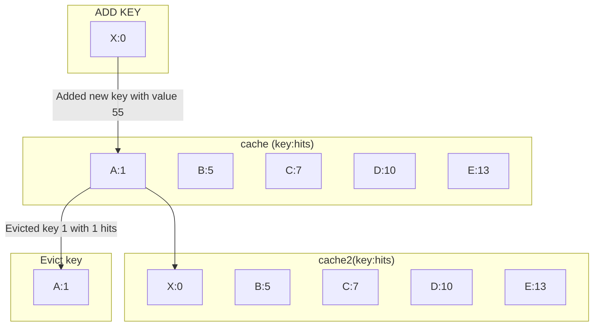

# In memory cache implementation in python

This project implements a simple in memory cache implementation in python.
With least accessed or lru_cache (Least Recently Used) eviction and replacement policy.



## basic usage

Initializes a cache object of size 10 and using "id" as cache key
```python
cache = Cache(10,hash_key="id")
cache.put({
    "id": "6600b6418bf59b69902a95ca",
    "email": "pace_rivera@olucore.es",
    "roles": [
      "guest",
      "owner"
    ],
    "profile": {
      "dob": "1992-09-29",
      "name": "Pace Rivera",
      "about": "Anim cupidatat elit ut occaecat consectetur do nisi consequat mollit. Nisi officia dolore id esse velit.",
      "address": "22 Calder Place, Mooresburg, Missouri",
      "company": "Olucore",
      "location": {
        "lat": 26.236175,
        "long": 156.744712
      }
    },
    "username": "pace92",
    "createdAt": "2012-07-11T18:11:54.040Z",
    "updatedAt": "2012-07-12T18:11:54.040Z"
  })
cache.stats()
```
The script will print the output as below for cache hits
```bash
┌──────────────────────────────────┬────────┐
│ key                              │   Hits │
├──────────────────────────────────┼────────┤
│ 7557457053c85ce298cec0943ef005a9 │      0 │
├──────────────────────────────────┼────────┤
│ 5552c91d88f02d64fc5c505a5da99ef3 │      0 │
├──────────────────────────────────┼────────┤
│ 4facabbbb86de55456ab10a72e082a7a │      0 │
├──────────────────────────────────┼────────┤
│ 2ef1d6ba53f9d852668e0c46cd0d0b30 │      0 │
├──────────────────────────────────┼────────┤
│ 56cd508b04ac9a53aa2cdf68536d6963 │      0 │
├──────────────────────────────────┼────────┤
│ e8ee65dcdaf504a45ef717e3c111ed7d │      0 │
├──────────────────────────────────┼────────┤
│ bc8b811845ceaf9b14c0721d97c30691 │      0 │
├──────────────────────────────────┼────────┤
│ 785702be8401728d942075fbe2372b72 │      0 │
├──────────────────────────────────┼────────┤
│ 56e812dac283d0df19bada604f155367 │      0 │
├──────────────────────────────────┼────────┤
│ 3240bf8a1bd85d20b9ce611947fe879b │      0 │
└──────────────────────────────────┴────────┘
```
when adding next key with value 55 it will evict the least accessed key: 3240bf8a1bd85d20b9ce611947fe879b
```bash
┌──────────────────────────────────┬────────┐
│ key                              │   Hits │
├──────────────────────────────────┼────────┤
│ 7557457053c85ce298cec0943ef005a9 │      6 │
├──────────────────────────────────┼────────┤
│ 5552c91d88f02d64fc5c505a5da99ef3 │      8 │
├──────────────────────────────────┼────────┤
│ 4facabbbb86de55456ab10a72e082a7a │     13 │
├──────────────────────────────────┼────────┤
│ 2ef1d6ba53f9d852668e0c46cd0d0b30 │      9 │
├──────────────────────────────────┼────────┤
│ 56cd508b04ac9a53aa2cdf68536d6963 │      8 │
├──────────────────────────────────┼────────┤
│ e8ee65dcdaf504a45ef717e3c111ed7d │      6 │
├──────────────────────────────────┼────────┤
│ bc8b811845ceaf9b14c0721d97c30691 │      8 │
├──────────────────────────────────┼────────┤
│ 785702be8401728d942075fbe2372b72 │      8 │
├──────────────────────────────────┼────────┤
│ 56e812dac283d0df19bada604f155367 │      9 │
├──────────────────────────────────┼────────┤
│ 3240bf8a1bd85d20b9ce611947fe879b │      4 │
└──────────────────────────────────┴────────┘
insert new key and evict less used
DEBUG:__main__:evicting key 3240bf8a1bd85d20b9ce611947fe879b from cache
DEBUG:__main__:invalidating key 3240bf8a1bd85d20b9ce611947fe879b from cache
DEBUG:__main__:Object with hash 81051f331bd925ce4b1b7eaaf4364d49 added to cache
┌──────────────────────────────────┬────────┐
│ key                              │   Hits │
├──────────────────────────────────┼────────┤
│ 7557457053c85ce298cec0943ef005a9 │      6 │
├──────────────────────────────────┼────────┤
│ 5552c91d88f02d64fc5c505a5da99ef3 │      8 │
├──────────────────────────────────┼────────┤
│ 4facabbbb86de55456ab10a72e082a7a │     13 │
├──────────────────────────────────┼────────┤
│ 2ef1d6ba53f9d852668e0c46cd0d0b30 │      9 │
├──────────────────────────────────┼────────┤
│ 56cd508b04ac9a53aa2cdf68536d6963 │      8 │
├──────────────────────────────────┼────────┤
│ e8ee65dcdaf504a45ef717e3c111ed7d │      6 │
├──────────────────────────────────┼────────┤
│ bc8b811845ceaf9b14c0721d97c30691 │      8 │
├──────────────────────────────────┼────────┤
│ 785702be8401728d942075fbe2372b72 │      8 │
├──────────────────────────────────┼────────┤
│ 56e812dac283d0df19bada604f155367 │      9 │
├──────────────────────────────────┼────────┤
│ 81051f331bd925ce4b1b7eaaf4364d49 │      0 │
└──────────────────────────────────┴────────┘
```