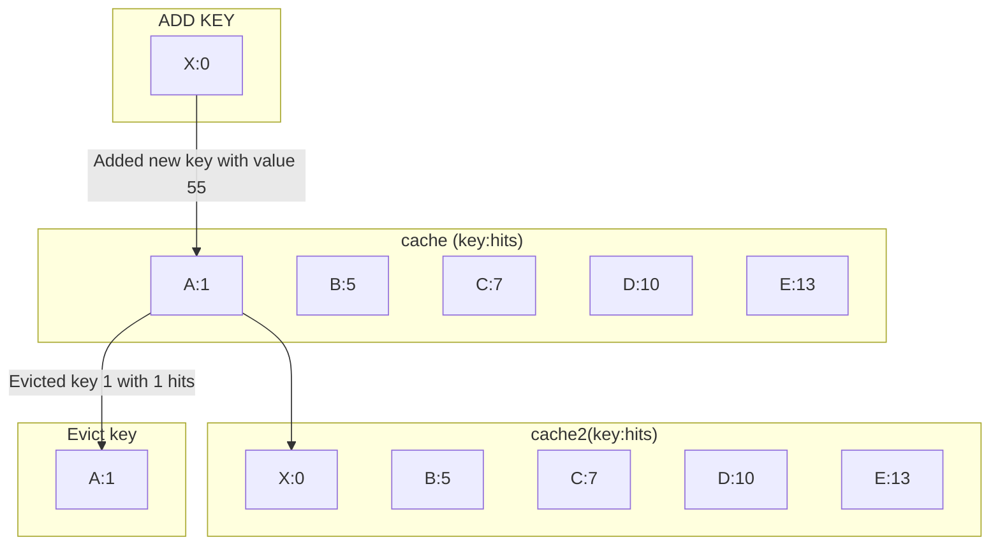

# In memory cache implementation in python

This project implements a simple in memory cache implementation in python.
With least accessed or lru_cache (Least Recently Used) eviction and replacement policy.



## basic usage

Initializes a cache object of size 10 and using "id" as cache key
```python
cache = Cache(10,hash_key="id")
```
